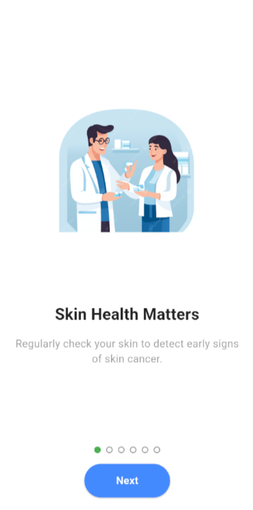
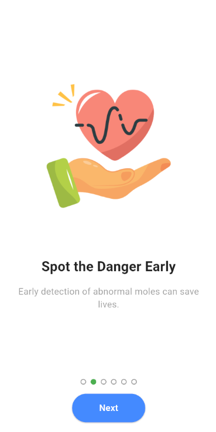
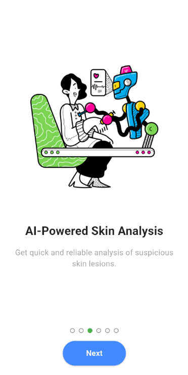
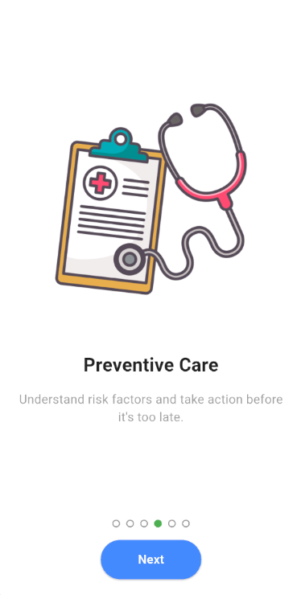
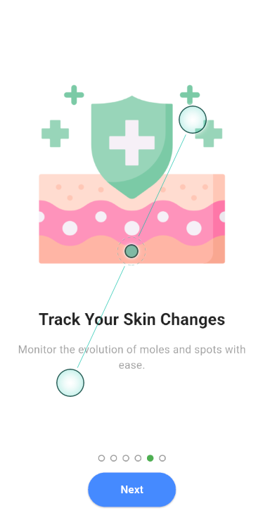
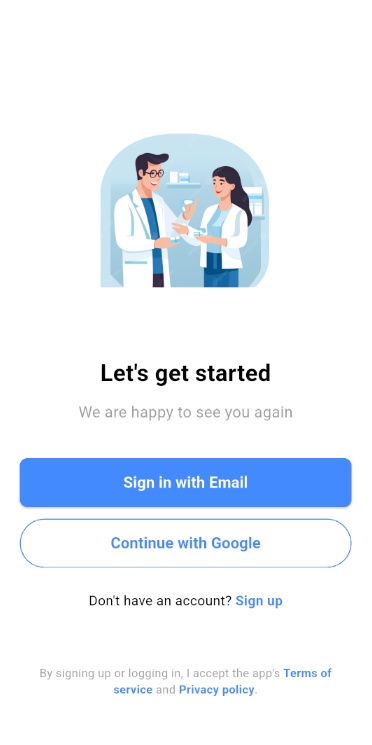
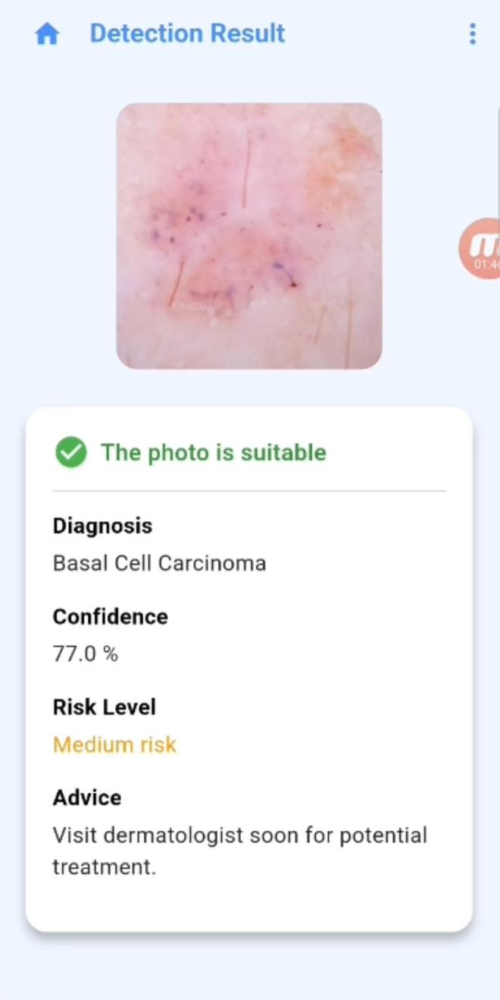
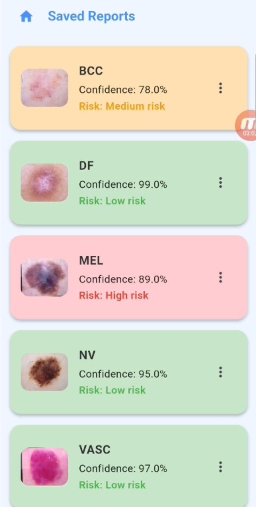
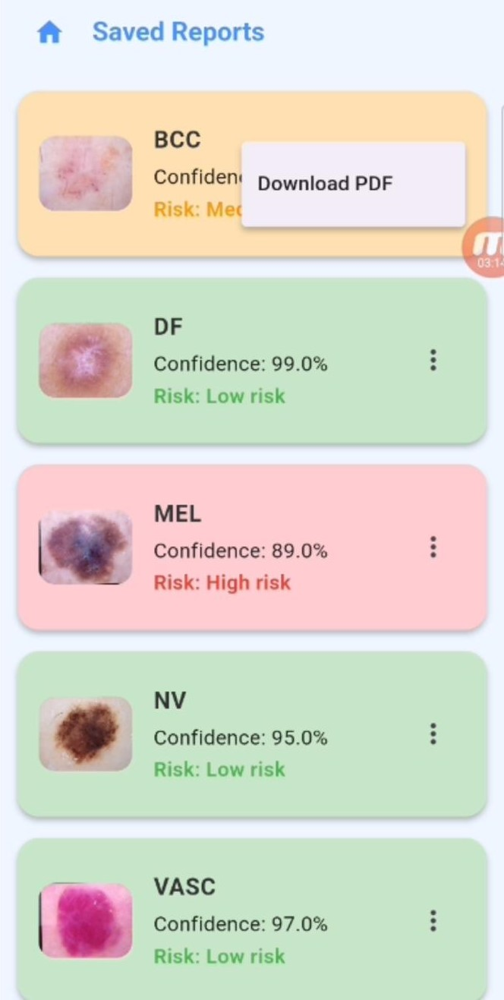
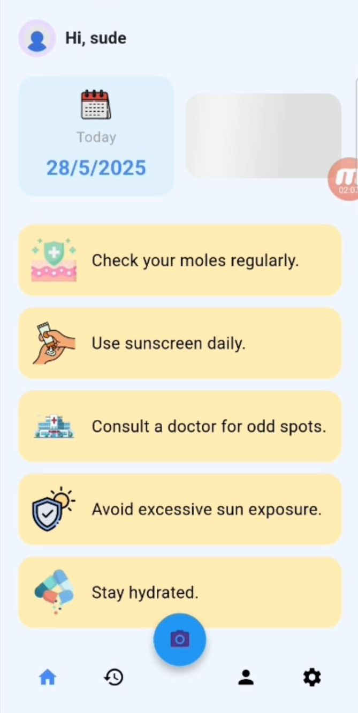

# 🧠 Skin Cancer Detection App

An AI-powered Flutter application that helps users detect early signs of skin cancer using deep learning models.  
The app supports image classification, detailed medical-like reports, exportable PDF summaries, and personalized skincare advice.  
Designed with a clean user interface and backed by an ensemble of well-trained models.

---

## 📱 Screenshots

### 👋 Onboarding Flow

<table align="center">
  <tr>
    <td align="center">
      <br/>
      <b>Skin Health Matters</b><br/>
      Introduces users to the purpose of skin health tracking.
    </td>
    <td align="center">
      <br/>
      <b>Spot the Danger Early</b><br/>
      Educates about early mole detection benefits.
    </td>
    <td align="center">
      <br/>
      <b>AI-Powered Skin Analysis</b><br/>
      Highlights the use of artificial intelligence in diagnosis.
    </td>
  </tr>
  <tr>
    <td align="center">
      <br/>
      <b>Preventive Care</b><br/>
      Encourages proactive habits for skin health.
    </td>
    <td align="center">
      <br/>
      <b>Track Your Skin Changes</b><br/>
      Promotes regular tracking of moles and lesions.
    </td>
    <td align="center">
      <br/>
      <b>Your Health, Our Priority</b><br/>
      Builds user trust with privacy and security focus.
    </td>
  </tr>
</table>

---

### 🔐 Authentication

<p align="center">
  <br/>
  Sign in securely via Email or Google to access all features.
</p>

---

### 🧪 Prediction Result

<p align="center">
  <br/>
  Real-time prediction results with diagnostic confidence and expert-level advice.
</p>

---

### 📊 Saved Reports

<p align="center">
  
  <br/>
  View past analysis, diagnosis, and download professional PDF reports.
</p>

---

### 🏠 Home Page

<p align="center">
  <br/>
  Get daily skin health tips personalized for you.
</p>

---

## 🧩 Tech Stack

This project is a full-stack AI-powered mobile solution combining mobile development, backend APIs, and deep learning.

- **Frontend:** Flutter (Dart) for multi-platform mobile UI
- **Backend:** FastAPI (Python) for scalable API development
- **Modeling:** TensorFlow/Keras for classification, YOLO for mask preprocessing
- **Database:** MongoDB with Motor (async I/O)
- **Authentication:** JWT-based auth + Google Sign-In
- **Extras:** PDF report generation, email verification, Docker containerization

---

## 📂 Folder Structure (Frontend)

```
lib/
├── app/              # Routing configuration
├── assets/           # Fonts and UI illustrations
├── core/             # Theme colors, utilities
├── models/           # Dart models (request/response)
├── screens/          # UI logic, grouped by feature
├── services/         # RESTful API interactions
├── widgets/          # Reusable widgets
└── main.dart         # App entry point
```

---

## 🧠 Model Overview (Backend)

This app uses a **multi-stage ensemble pipeline** for image classification:

- Stage 1: Binary classifier (Melanoma detection)
- Stage 2: Nevus vs Not Nevus
- Stage 3: Benign vs Malignant
- Stage 4: Subtype diagnosis (AKIEC, BCC, DF, VASC, BKL)

All Keras models are loaded dynamically at inference time. Each model folder contains:

```
/models/                 # xception, densenet, cnn
├── melanoma_models/
├── nevus_models/
├── binary_models/       # malignant or benign
├── malignant_models/    # akiec, bcc
└── benign_models/       # df, vasc, bkl
```

---

## 🧪 Model Training

The models used were trained on curated datasets with class balance, augmentation, and validation monitoring.

> 🔗 **[Model Training Repository](https://github.com/erenisci/skin-cancer-detection)**

---

## 🚀 Getting Started

### 🔧 Backend (FastAPI)

```bash
cd backend
python -m venv venv
source venv/bin/activate  # or .\venv\Scripts\activate on Windows
pip install -r requirements.txt
uvicorn main:app --reload
```

### 📱 Frontend (Flutter)

```bash
cd frontend
flutter pub get
flutter run
```

---

## 📦 API Endpoints

| Method | Endpoint       | Description                 |
| ------ | -------------- | --------------------------- |
| POST   | `/auth/login`  | User authentication         |
| POST   | `/auth/signup` | Create new user             |
| POST   | `/detect`      | Upload image for prediction |
| POST   | `/report`      | Save analysis report        |
| GET    | `/report/me`   | Fetch user reports          |

---

## 📌 Features

- ✅ AI-powered skin lesion classification
- ✅ Dynamic multi-stage ensemble prediction
- ✅ PDF exportable diagnosis reports
- ✅ Google & email authentication
- ✅ MongoDB cloud data storage
- ✅ Real-time tips & diagnosis feedback
- ✅ Docker support (optional)

---

## 👥 Contributors

We worked on this project together:

- [@erenisci](https://github.com/erenisci)
- [@zscengiz](https://github.com/zscengiz)
- [@MeldaErylmz](https://github.com/MeldaErylmz)

---

## 🧠 Disclaimer

All medical advice in this app is for **educational purposes only**.  
For diagnosis or treatment decisions, consult a certified dermatologist or physician.

---

## 📄 License

This project is licensed under the **MIT License**.  
See the [LICENSE](LICENSE) file for full legal terms.
