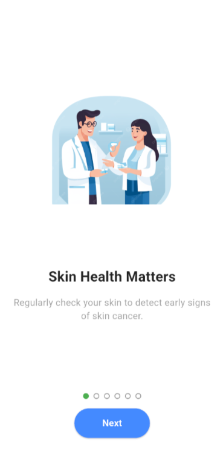
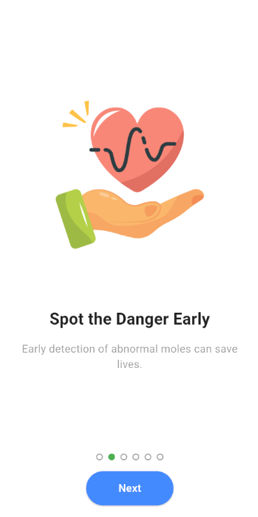
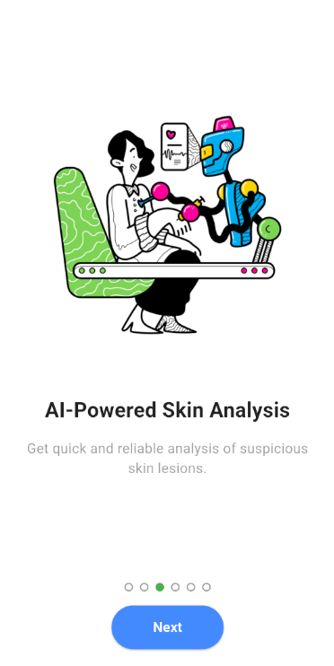
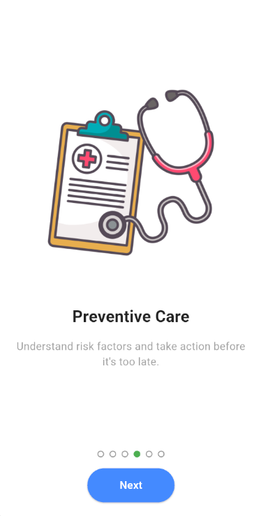
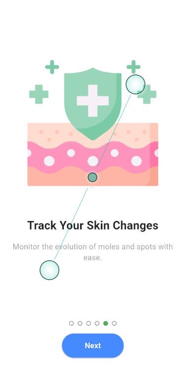
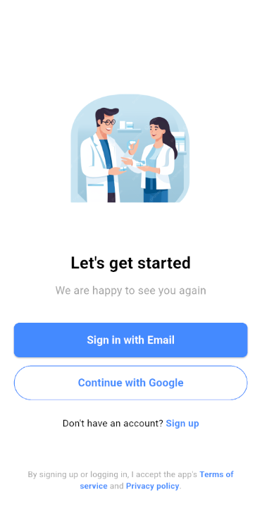
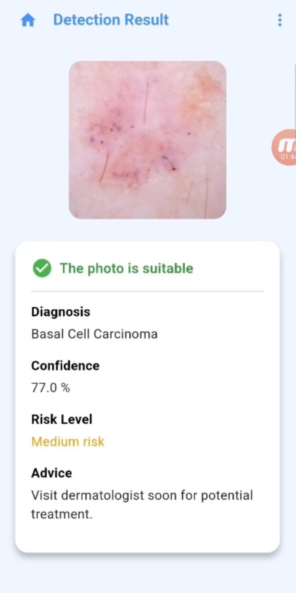
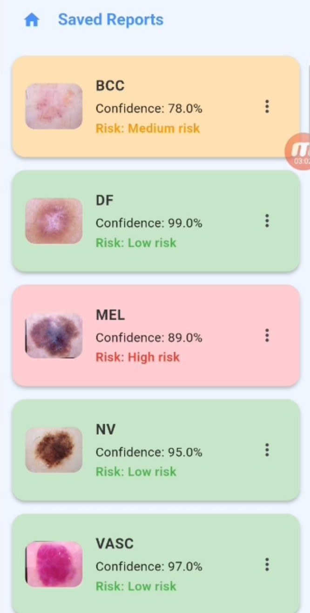
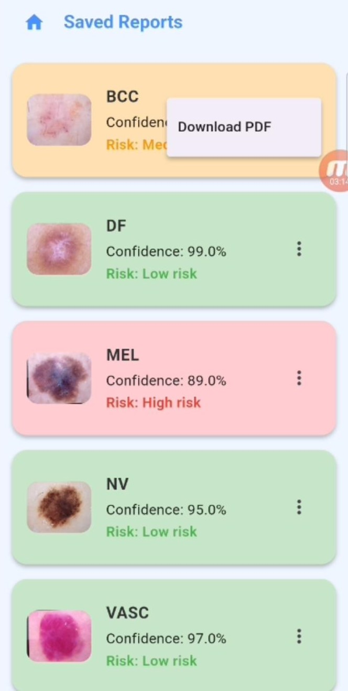
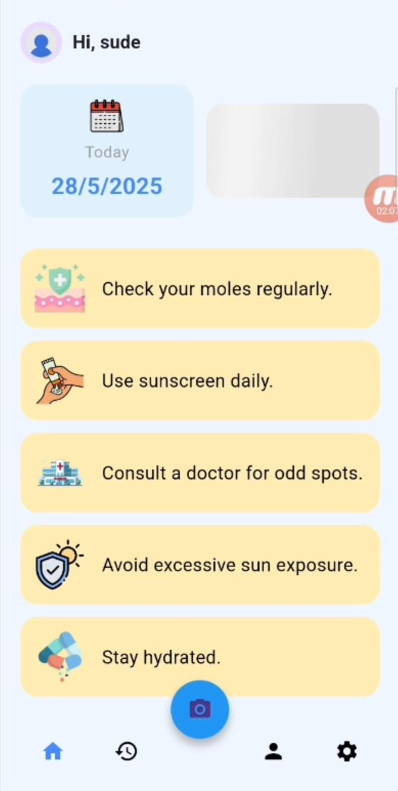

# Skin Cancer Detection App

A fullstack Flutter + FastAPI application for skin cancer lesion tracking. Supports image upload, diagnosis result display, exportable PDF reports, and personalized skincare advice — backed by a FastAPI backend and MongoDB. ML model integration is ready but model files are not included in this repository (see `backend/models/README.md`).

---

## Screenshots

### Onboarding Flow

<table align="center">
  <tr>
    <td align="center">
      <br/>
      <b>Skin Health Matters</b><br/>
      Introduces users to the purpose of skin health tracking.
    </td>
    <td align="center">
      <br/>
      <b>Spot the Danger Early</b><br/>
      Educates about early mole detection benefits.
    </td>
    <td align="center">
      <br/>
      <b>AI-Powered Skin Analysis</b><br/>
      Highlights the ML-based classification pipeline.
    </td>
  </tr>
  <tr>
    <td align="center">
      <br/>
      <b>Preventive Care</b><br/>
      Encourages proactive habits for skin health.
    </td>
    <td align="center">
      <br/>
      <b>Track Your Skin Changes</b><br/>
      Promotes regular tracking of moles and lesions.
    </td>
    <td align="center">
      <br/>
      <b>Your Health, Our Priority</b><br/>
      Builds user trust with privacy and security focus.
    </td>
  </tr>
</table>

---

### Authentication

<p align="center">
  <br/>
  Sign in securely via email to access all features.
</p>

---

### Prediction Result

<p align="center">
  <br/>
  Prediction results with diagnostic confidence and expert-level advice.
</p>

---

### Saved Reports

<p align="center">
  
  <br/>
  View past analyses and download professional PDF reports.
</p>

---

### Home Page

<p align="center">
  <br/>
  Daily skin health tips and real-time UV index data.
</p>

---

## Tech Stack

| Layer    | Technology                                                            |
| -------- | --------------------------------------------------------------------- |
| Frontend | Flutter (Dart), go_router, provider                                   |
| Backend  | FastAPI (Python 3.12), Uvicorn                                        |
| AI / ML  | TensorFlow 2.x / Keras — ensemble pipeline (model files not included) |
| Database | MongoDB with Motor (async)                                            |
| Auth     | JWT (access + refresh tokens), bcrypt                                 |
| Reports  | PDF generation, GridFS file storage                                   |
| Email    | SMTP via aiosmtplib                                                   |

---

## Model Overview

The classification pipeline is multi-stage and hierarchical. Each stage runs a weighted ensemble of 3 models (XceptionNet, DenseNet121, CNN):

```
Input image (any size)
  │
  ▼ Preprocessing → 224×224, normalized [0, 1]
  │
  ▼ Stage 0 — Melanoma?         (weights: 0.4 / 0.3 / 0.3)
      score > 0.5 → MEL
  │
  ▼ Stage 1 — Nevus?            (weights: 0.35 / 0.55 / 0.1)
      score < 0.5 → NV  ⚠ inverted label
  │
  ▼ Stage 2 — Benign or Malignant?  (weights: 0.3 / 0.3 / 0.4)
  │
  ├─ Malignant → Stage 3: AKIEC or BCC   (weights: 0.2 / 0.4 / 0.4)
  └─ Benign   → Stage 4: BKL, DF, VASC  (weights: 0.2 / 0.6 / 0.2)
```

**Total: 15 model files required** — see `backend/models/` for the expected structure.

> Model training repository: [skin-cancer-detection](https://github.com/erenisci/skin-cancer-detection)

---

## Getting Started

### Backend (FastAPI)

```bash
# Start MongoDB
"C:\Program Files\MongoDB\Server\7.0\bin\mongod.exe" --dbpath "C:\data\db"

# Start backend
cd backend
"C:\Program Files\Python312\python.exe" -m uvicorn main:app --host 0.0.0.0 --port 8000
```

Swagger UI: `http://localhost:8000/docs`

### Frontend (Flutter)

```bash
cd frontend
flutter pub get
flutter run
```

Set your local IP in `frontend/.env`:

```
API_URL=http://<your-local-ip>:8000
```

---

## API Endpoints

| Method | Endpoint                           | Auth | Description                     |
| ------ | ---------------------------------- | ---- | ------------------------------- |
| POST   | `/api/auth/signup`                 | No   | Register a new user             |
| POST   | `/api/auth/login`                  | No   | Login and receive tokens        |
| POST   | `/api/auth/refresh-token`          | No   | Exchange refresh token          |
| POST   | `/api/auth/request-password-reset` | No   | Send password reset email       |
| POST   | `/api/auth/reset-password`         | No   | Reset password with token       |
| POST   | `/api/auth/update-profile`         | JWT  | Update user profile             |
| POST   | `/api/auth/change-password`        | JWT  | Change password                 |
| POST   | `/api/auth/logout`                 | No   | Invalidate tokens               |
| POST   | `/detect`                          | No   | Upload image for classification |
| POST   | `/api/reports/upload`              | JWT  | Save detection report           |
| GET    | `/api/reports/me`                  | JWT  | Fetch user's reports            |
| GET    | `/api/reports/pdf/{id}`            | JWT  | Download PDF report             |
| GET    | `/api/reports/image/{id}`          | JWT  | Download report image           |

---

## Features

- Skin lesion image upload and classification result display (7 classes: MEL, NV, BCC, AKIEC, BKL, DF, VASC)
- Multi-stage ensemble prediction pipeline (requires model files — see `backend/models/README.md`)
- Exportable PDF diagnosis reports
- Email-based authentication with password reset
- MongoDB cloud-ready data storage
- Light and dark theme

---

## Contributors

- [@erenisci](https://github.com/erenisci)
- [@zscengiz](https://github.com/zscengiz)
- [@MeldaErylmz](https://github.com/MeldaErylmz)

---

## Disclaimer

All medical information in this app is for **educational purposes only**.
For any diagnosis or treatment decision, consult a certified dermatologist or physician.

---

## License

This project is licensed under the **MIT License**.
See the [LICENSE](LICENSE) file for full legal terms.
